# 🛒 Sales Order API

<div align="center">


</div>

> API RESTful para gerenciamento de **Pedidos de Venda** desenvolvida com **TypeScript**, **Express** e **MySQL2**. O projeto aplica **Orientação a Objetos** com herança, abstração e encapsulamento, além dos padrões de projeto **Factory Method**, **Repository** e **Singleton**, organizados em uma arquitetura limpa em camadas.

---

## 📋 Sumário

- [Visão Geral](#-visão-geral)
- [Estrutura do Projeto](#-estrutura-do-projeto)
- [Arquitetura](#️-arquitetura)
- [Modelo de Domínio](#-modelo-de-domínio-oop)
- [Banco de Dados](#️-banco-de-dados)
- [Ciclo de Vida de uma Requisição](#-ciclo-de-vida-de-uma-requisição)
- [Endpoints da API](#-endpoints-da-api)
- [Validações de Negócio](#-validações-de-negócio)
- [Padrões de Projeto](#-padrões-de-projeto)
- [Tecnologias](#-tecnologias)
- [Qualidade de Código](#-qualidade-de-código)
- [Como Executar](#-como-executar)

---

## 🔎 Visão Geral

A **Sales Order API** é um sistema backend completo para gestão de vendas, cobrindo o ciclo inteiro: cadastro de **Categorias**, **Produtos** (com upload de imagem via Multer), **Clientes**, **Vendedores** e **Pedidos** com seus respectivos itens.

O projeto foi construído com foco em:

- **Separação de responsabilidades** rigorosa entre as camadas
- **Entidades ricas** com validações encapsuladas nas próprias classes de domínio
- **Transações atômicas** no banco de dados (BEGIN / COMMIT / ROLLBACK)
- **Herança e abstração** via classe `Pessoa` para `Cliente` e `Vendedor`
- **Código aprovado** pelo SonarQube sem issues críticas

---

## 📁 Estrutura do Projeto

```
├── 📁 docs
│   ├── 📝 atividade.md            # Requisitos do projeto
│   ├── 📄 db.sql                  # Schema completo do banco de dados
│   ├── 📄 insomnia.json           # Collection para importar no Insomnia
│   ├── 📝 testes.md               # Guia de testes com cenários e bodies
│   └── 📝 diagram.md              # Diagramas ERD e de fluxo
├── 📁 src
│   ├── 📁 config
│   │   ├── 📁 enum
│   │   │   └── 📄 EnvKey.ts           # Enum com as chaves de variáveis de ambiente
│   │   ├── 📄 EnvVar.ts               # Carregamento e acesso às variáveis de ambiente
│   │   └── 📄 produto.multer.ts       # Configuração do Multer para upload de imagens
│   ├── 📁 controllers
│   │   ├── 📄 categoria.controller.ts
│   │   ├── 📄 cliente.controller.ts
│   │   ├── 📄 pedido.controller.ts
│   │   ├── 📄 produto.controller.ts
│   │   └── 📄 vendedor.controller.ts
│   ├── 📁 database
│   │   └── 📄 db.connection.ts        # Pool de conexão MySQL2 (Singleton)
│   ├── 📁 middleware
│   │   └── 📄 upload.middleware.ts    # Middleware de upload de arquivos
│   ├── 📁 models
│   │   ├── 📄 pessoa.model.ts         # Classe abstrata base (herança)
│   │   ├── 📄 cliente.model.ts        # Herda de Pessoa
│   │   ├── 📄 vendedor.model.ts       # Herda de Pessoa
│   │   ├── 📄 categoria.model.ts
│   │   ├── 📄 produto.model.ts
│   │   ├── 📄 pedido.model.ts         # Agrega ItemPedido + calcularTotal()
│   │   └── 📄 itemPedido.model.ts
│   ├── 📁 repository
│   │   ├── 📄 categoria.repository.ts
│   │   ├── 📄 cliente.repository.ts
│   │   ├── 📄 pedido.repository.ts    # Transação atômica BEGIN/COMMIT/ROLLBACK
│   │   ├── 📄 produto.repository.ts
│   │   └── 📄 vendedor.repository.ts
│   ├── 📁 routes
│   │   ├── 📄 routes.ts               # Roteador raiz (agrega todos os routers)
│   │   ├── 📄 categoria.routes.ts
│   │   ├── 📄 cliente.routes.ts
│   │   ├── 📄 pedido.routes.ts
│   │   ├── 📄 produto.routes.ts
│   │   └── 📄 vendedor.routes.ts
│   ├── 📁 services
│   │   ├── 📄 categoria.service.ts
│   │   ├── 📄 cliente.service.ts
│   │   ├── 📄 pedido.service.ts
│   │   ├── 📄 produto.service.ts
│   │   └── 📄 vendedor.service.ts
│   └── 📄 server.ts                   # Ponto de entrada da aplicação Express
├── 📁 uploads
│   └── 📁 images                      # Imagens enviadas pelo Multer
├── ⚙️ .gitignore
├── ⚙️ package.json
└── ⚙️ tsconfig.json
```

---

## 🏗️ Arquitetura

O projeto adota uma **arquitetura em 4 camadas** com fluxo de dependência unidirecional. O roteador raiz agrega todos os sub-roteadores, e cada camada possui uma responsabilidade única e bem definida.

```mermaid
Flowchat TD

    Client(["🌐 Cliente HTTP\n(Insomnia / Postman)"])

    subgraph ExpressLayer["⚡ Camada Express"]
        Router["📍 routes.ts\n(Roteador Raiz)"]
        R1["categoria.routes.ts"]
        R2["produto.routes.ts"]
        R3["cliente.routes.ts"]
        R4["vendedor.routes.ts"]
        R5["pedido.routes.ts"]
        Router --> R1 & R2 & R3 & R4 & R5
    end

    subgraph ControllerLayer["🎮 Camada Controller"]
        CC["CategoriaController"]
        PC["ProdutoController"]
        CLC["ClienteController"]
        VC["VendedorController"]
        PDC["PedidoController"]
    end

    subgraph ServiceLayer["⚙️ Camada Service"]
        CS["CategoriaService"]
        PS["ProdutoService"]
        CLS["ClienteService"]
        VS["VendedorService"]
        PDS["PedidoService"]
    end

    subgraph RepositoryLayer["🗃️ Camada Repository"]
        CR["CategoriaRepository"]
        PR["ProdutoRepository"]
        CLR["ClienteRepository"]
        VR["VendedorRepository"]
        PDR["PedidoRepository\n⚛️ Transação Atômica"]
    end

    subgraph ModelLayer["🧬 Camada Model / Domínio"]
        Pessoa["«abstract»\nPessoa"]
        Cliente["Cliente"]
        Vendedor["Vendedor"]
        Categoria["Categoria"]
        Produto["Produto"]
        Pedido["Pedido\ncalcularTotal()"]
        Item["ItemPedido\nSubtotal getter"]
        Pessoa -->|herança| Cliente
        Pessoa -->|herança| Vendedor
        Pedido -->|agrega| Item
    end

    DB[("🗄️ MySQL 8\nSingleton Pool")]

    Client -->|"HTTP Request"| Router
    R1 --> CC
    R2 --> PC
    R3 --> CLC
    R4 --> VC
    R5 --> PDC
    CC --> CS --> CR
    PC --> PS --> PR
    CLC --> CLS --> CLR
    VC --> VS --> VR
    PDC --> PDS --> PDR
    CS --> Categoria
    PS --> Produto
    CLS --> Cliente
    VS --> Vendedor
    PDS --> Pedido
    CR & PR & CLR & VR & PDR -->|"SQL parametrizado"| DB
```

### Responsabilidades por Camada

| Camada         | Arquivo(s)        | Responsabilidade                                                    |
| -------------- | ----------------- | ------------------------------------------------------------------- |
| **Route**      | `*.routes.ts`     | Mapear verbos HTTP para métodos do Controller                       |
| **Controller** | `*.controller.ts` | Receber requisições HTTP, validar entrada, retornar respostas       |
| **Service**    | `*.service.ts`    | Orquestrar regras de negócio, instanciar objetos via Factory Method |
| **Repository** | `*.repository.ts` | Executar queries SQL com parâmetros seguros contra SQL Injection    |
| **Model**      | `*.model.ts`      | Representar entidades com validações internas e encapsulamento      |

---

## 🧬 Modelo de Domínio (OOP)

A camada de domínio utiliza **herança**, **abstração**, **encapsulamento** e **polimorfismo** para modelar as entidades. O padrão **Factory Method** é aplicado como métodos estáticos descritivos.

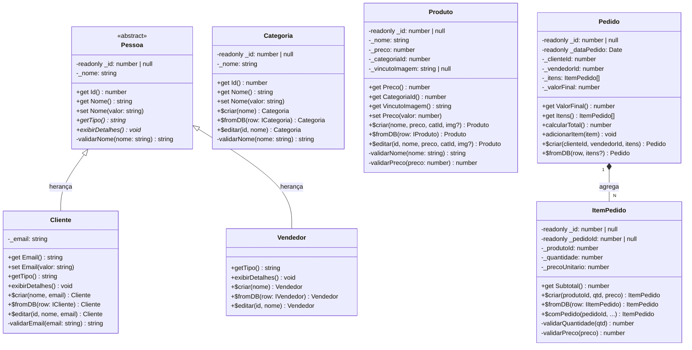

---

## 🗄️ Banco de Dados

O banco utiliza **MySQL 8** com chaves estrangeiras, restrições de integridade e registro automático de data de pedido via `DEFAULT CURRENT_TIMESTAMP`.

### Diagrama Entidade-Relacionamento

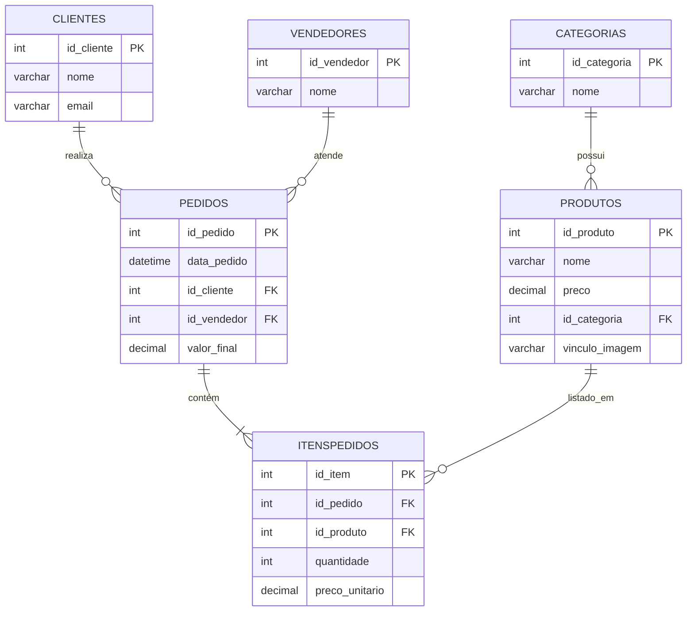

### Relacionamentos

| Relacionamento        | Cardinalidade | Descrição                                |
| --------------------- | ------------- | ---------------------------------------- |
| Categoria → Produto   | 1:N           | Uma categoria possui vários produtos     |
| Cliente → Pedido      | 1:N           | Um cliente pode realizar vários pedidos  |
| Vendedor → Pedido     | 1:N           | Um vendedor pode atender vários pedidos  |
| Pedido → ItensPedido  | 1:N           | Um pedido contém vários itens            |
| Produto → ItensPedido | 1:N           | Um produto pode aparecer em vários itens |

---

## 🔄 Ciclo de Vida de uma Requisição

### Criação de Pedido (`POST /pedidos`)

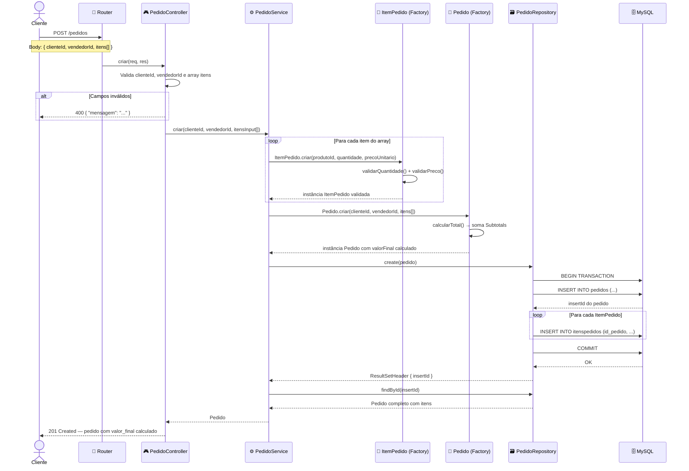

### Fluxo de Rollback em caso de falha

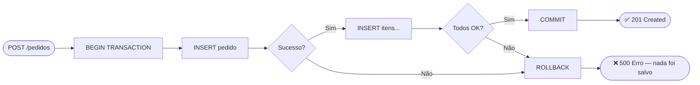

---

## 📡 Endpoints da API

### 📦 Categorias — `/categorias`

| Método   | Rota              | Descrição                 |
| -------- | ----------------- | ------------------------- |
| `GET`    | `/categorias`     | Lista todas as categorias |
| `GET`    | `/categorias/:id` | Busca categoria por ID    |
| `POST`   | `/categorias`     | Cria uma nova categoria   |
| `PUT`    | `/categorias/:id` | Atualiza uma categoria    |
| `DELETE` | `/categorias/:id` | Remove uma categoria      |

### 🏷️ Produtos — `/produtos`

| Método   | Rota                               | Descrição                                |
| -------- | ---------------------------------- | ---------------------------------------- |
| `GET`    | `/produtos`                        | Lista todos os produtos                  |
| `GET`    | `/produtos/:id`                    | Busca produto por ID                     |
| `GET`    | `/produtos/categoria/:categoriaId` | Lista produtos por categoria             |
| `POST`   | `/produtos`                        | Cria produto (`multipart/form-data`)     |
| `PUT`    | `/produtos/:id`                    | Atualiza produto (`multipart/form-data`) |
| `DELETE` | `/produtos/:id`                    | Remove um produto                        |

### 👤 Clientes — `/clientes`

| Método   | Rota            | Descrição               |
| -------- | --------------- | ----------------------- |
| `GET`    | `/clientes`     | Lista todos os clientes |
| `GET`    | `/clientes/:id` | Busca cliente por ID    |
| `POST`   | `/clientes`     | Cria um novo cliente    |
| `PUT`    | `/clientes/:id` | Atualiza um cliente     |
| `DELETE` | `/clientes/:id` | Remove um cliente       |

### 🧑‍💼 Vendedores — `/vendedores`

| Método   | Rota              | Descrição                 |
| -------- | ----------------- | ------------------------- |
| `GET`    | `/vendedores`     | Lista todos os vendedores |
| `GET`    | `/vendedores/:id` | Busca vendedor por ID     |
| `POST`   | `/vendedores`     | Cria um novo vendedor     |
| `PUT`    | `/vendedores/:id` | Atualiza um vendedor      |
| `DELETE` | `/vendedores/:id` | Remove um vendedor        |

### 🧾 Pedidos — `/pedidos`

| Método   | Rota           | Descrição                               |
| -------- | -------------- | --------------------------------------- |
| `GET`    | `/pedidos`     | Lista todos os pedidos com itens        |
| `GET`    | `/pedidos/:id` | Busca pedido por ID com itens embutidos |
| `POST`   | `/pedidos`     | Cria pedido + itens em transação única  |
| `DELETE` | `/pedidos/:id` | Remove pedido e seus itens              |

### Mapa de Rotas

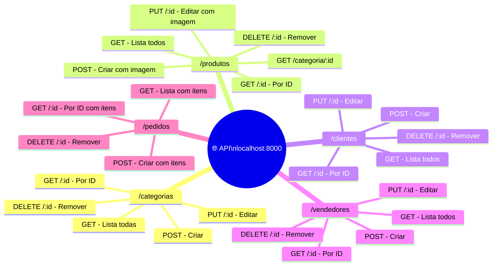

### Códigos HTTP

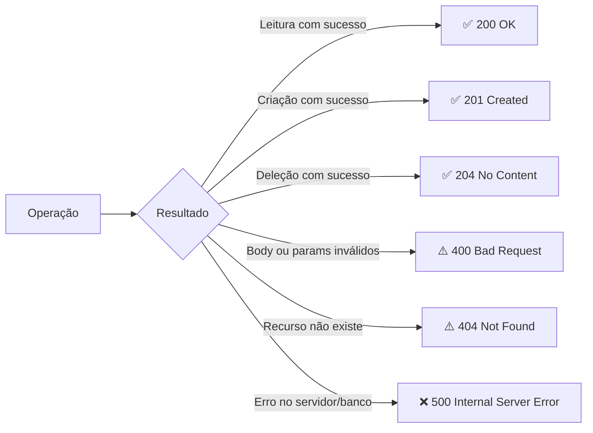

---

## ✅ Validações de Negócio

As validações são aplicadas diretamente nas **classes de domínio**, garantindo que nenhum objeto inválido chegue ao banco de dados.

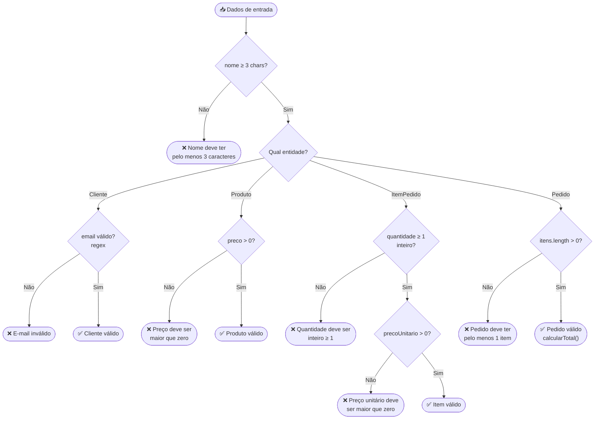

| Entidade     | Campo           | Regra                                 |
| ------------ | --------------- | ------------------------------------- |
| `Pessoa`     | `nome`          | Mínimo 3 caracteres após trim         |
| `Cliente`    | `email`         | Formato válido: `usuario@dominio.ext` |
| `Produto`    | `nome`          | Mínimo 3 caracteres                   |
| `Produto`    | `preco`         | Maior que zero                        |
| `ItemPedido` | `quantidade`    | Inteiro maior ou igual a 1            |
| `ItemPedido` | `precoUnitario` | Maior que zero                        |
| `Pedido`     | `itens`         | Array com pelo menos 1 item           |

---

## 📐 Padrões de Projeto

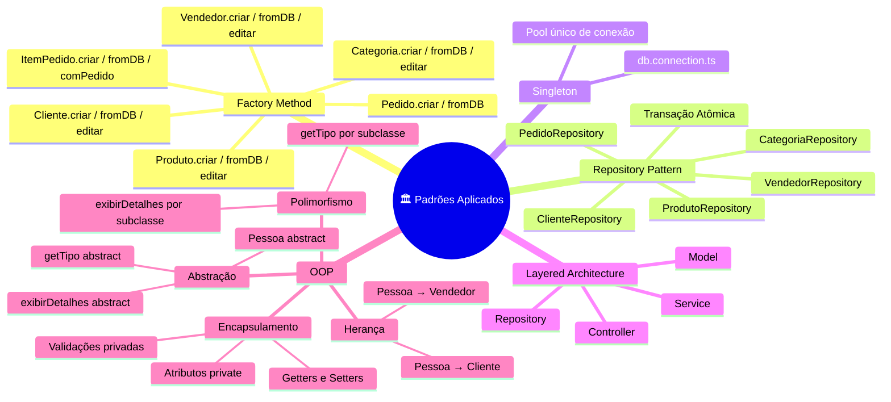

| Padrão                   | Onde é Aplicado                                                     | Benefício                                                                      |
| ------------------------ | ------------------------------------------------------------------- | ------------------------------------------------------------------------------ |
| **Factory Method**       | Métodos estáticos `criar`, `fromDB`, `editar` em todas as entidades | Controla criação de objetos, centraliza validações, evita instâncias inválidas |
| **Repository Pattern**   | `*Repository` — um por entidade                                     | Isola o SQL, torna o Service agnóstico ao banco, facilita manutenção           |
| **Singleton**            | `db.connection.ts` — pool de conexão único                          | Evita múltiplas conexões abertas, otimiza uso de recursos                      |
| **Layered Architecture** | Toda a estrutura do projeto                                         | Separação clara de responsabilidades e manutenibilidade                        |
| **Herança e Abstração**  | `Pessoa (abstract)` → `Cliente`, `Vendedor`                         | Reutilização de código e validações compartilhadas                             |

---

## 🛠️ Tecnologias

### Dependências de Produção

<div align="center">


</div>

### Dependências de Desenvolvimento

<div align="center">


</div>

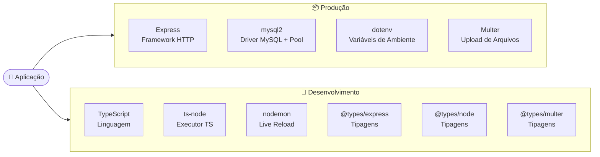

---

## 🔍 Qualidade de Código

O projeto foi analisado e aprovado pelo **SonarQube** sem nenhuma issue crítica ou bloqueante.

<div align="center">


</div>

O projeto utiliza o **SonarLint** (plugin SonarQube para VS Code) para análise estática em tempo real. As verificações incluem detecção de Code Smells, vulnerabilidades de segurança (incluindo SQL Injection), complexidade ciclomática e duplicação de código.

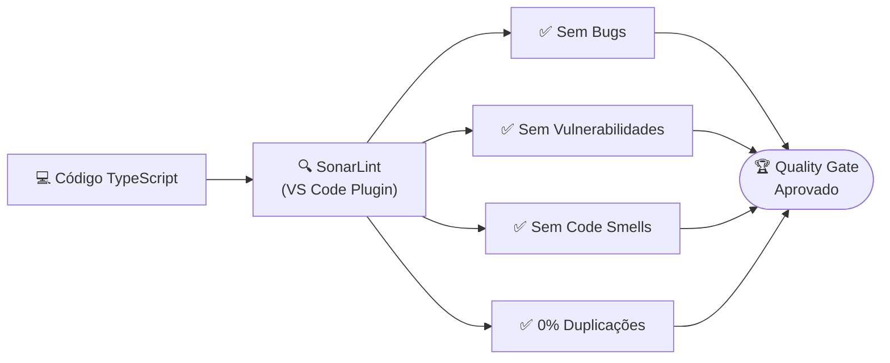

---

### Pré-requisitos

- Node.js (LTS)
- MySQL 8+
- npm

### Variáveis de Ambiente

```env
DB_HOST=localhost
DB_PORT=3306
DB_USER=root
DB_PASSWORD=sua_senha
DB_NAME=sales_order
PORT=8000
```

### Testes com Insomnia

Importe o arquivo `docs/insomnia.json` no Insomnia via **File → Import → From File** e siga a ordem recomendada:

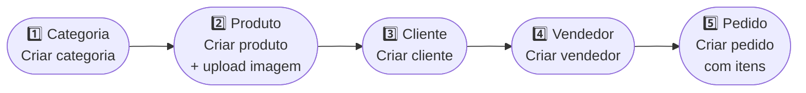

> ⚠️ Siga essa ordem para evitar erros de chave estrangeira (FK).

---

<div align="center">
  <sub>Projeto Acadêmico Backend SENAI — TypeScript · Express · MySQL2 · OOP · Design Patterns</sub>
</div>
