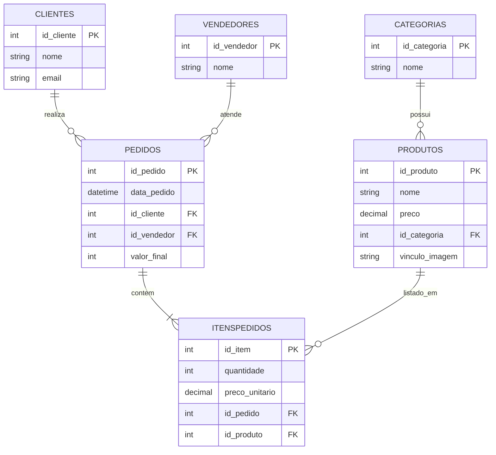

### Diagrama Entidade-Relacionamento (ERD)

### Relacionamentos

- **1 Categoria** pode ter **N Produtos** (1:N).
- **1 Cliente** pode fazer **N Pedidos** (1:N).
- **1 Vendedor** pode atender **N Pedidos** (1:N).
- **1 Pedido** pode ter **N ItensPedidos** (1:N).
- **1 Produto** pode aparecer em **N ItensPedidos** (1:N).
